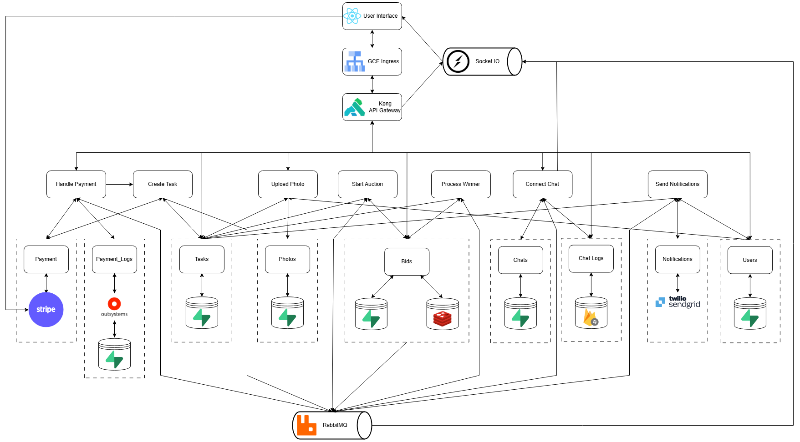
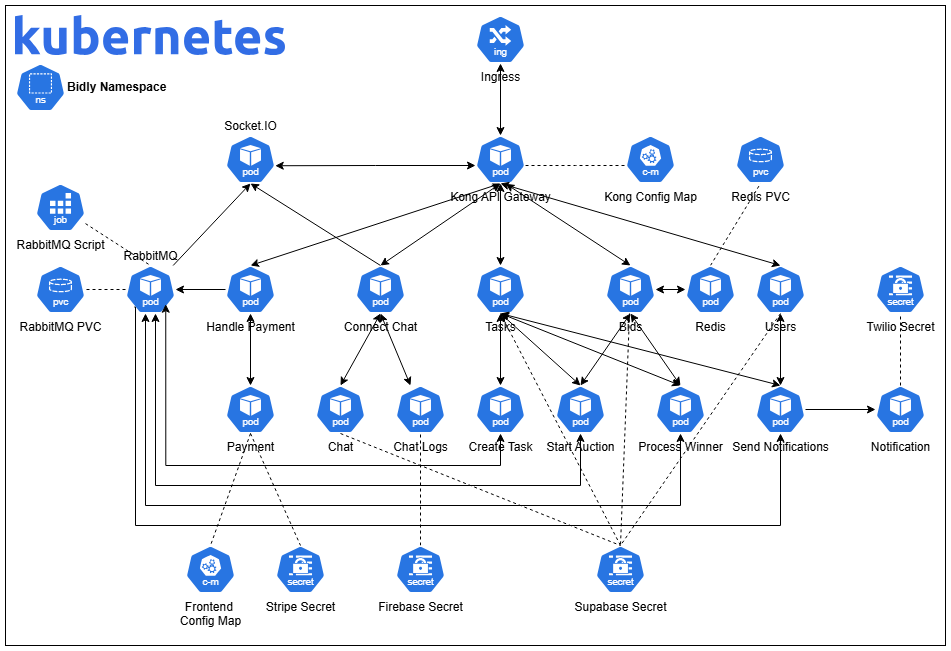
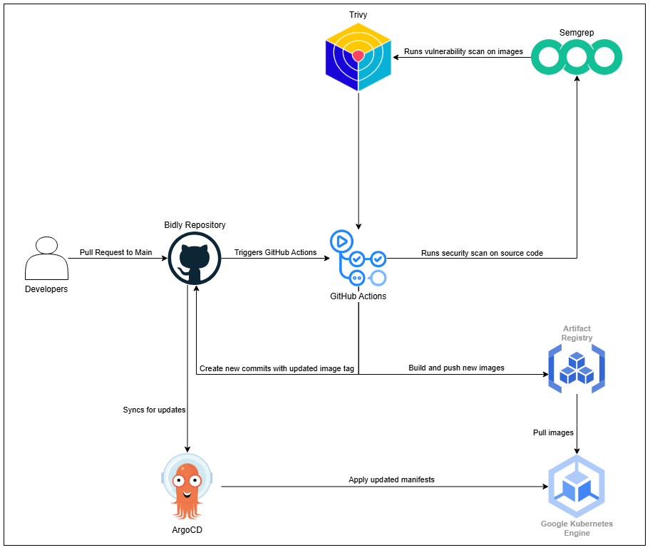

# Bidly 🔨

**Bidly** is a real-time task bidding platform where users can post tasks and receive competitive bids from service providers. Built with a microservices architecture, event-driven orchestration, and deployed on Google Cloud Platform.

---

## Prerequisites

- Docker Desktop
- Node Package Manager (npm)
- kubectl
- IDE (Any)

---

## Local Setup

> Ensure Docker Desktop is running

1. Start all backend services:
```bash
cd backend
docker-compose up -d --build
```

2. Start the frontend:
```bash
cd frontend
npm i
npm run dev
```

---

## System Architecture Diagram



## Cloud Architecture Diagram

## Kubernetes Architecture Diagram



## CI/CD Pipeline



---

## Technical Implementations

### Backend
- **Microservice Architecture** with loosely coupled atomic services
- **Event-Driven Orchestration** via RabbitMQ for async workflows
- **Swagger UI** auto-generated API documentation via FastAPI
- **WebSocket** server consuming RabbitMQ events for real-time updates
- **Kong API Gateway** for routing, CORS, and rate limiting
- **Redis** for real-time auction state with atomic bid placement via Lua scripting
- **Supabase (PostgreSQL)** as primary database
- **Firestore** for chat log storage
- **OutSystems** as low code provider and external microservice
- **Prometheus & Grafana** for metrics collection and observability dashboards
- **CI/CD pipeline** with automated Docker builds and GCP Artifact Registry pushes
- **Security scanning** with Semgrep (SAST) and Trivy (container vulnerabilities)
- **Argo CD** GitOps sync for Kubernetes deployments
- **GKE deployment** via declarative Kubernetes YAML manifests

### Frontend
- React + TypeScript + Vite SPA
- React Router for client-side routing
- Zustand for state management
- Axios for HTTP with JWT interceptors and token refresh
- Socket.io for real-time bid and chat updates
- Stripe React SDK for payment UI
- GSAP animations
- Deployed on Vercel

---

## Frameworks and Technologies

<p align="center"><strong>UI Stack</strong></p>
<p align="center">
<a href="https://vitejs.dev/"></a>&nbsp;&nbsp;
<a href="https://react.dev/"></a>&nbsp;&nbsp;
<a href="https://www.typescriptlang.org/"></a>&nbsp;&nbsp;
<a href="https://reactrouter.com/"></a>&nbsp;&nbsp;
<a href="https://zustand-demo.pmnd.rs/"></a>&nbsp;&nbsp;
<a href="https://axios-http.com/"></a>&nbsp;&nbsp;
<a href="https://gsap.com/"></a>&nbsp;&nbsp;
<br>
<i>Vite · React · TypeScript · React Router · Zustand · Axios · GSAP</i>
</p>
<br>

<p align="center"><strong>Microservices Languages</strong></p>
<p align="center">
<a href="https://www.python.org/"></a>&nbsp;&nbsp;
<a href="https://nodejs.org/"></a>&nbsp;&nbsp;
<a href="https://www.lua.org/"></a>&nbsp;&nbsp;
<br>
<i>Python · Node.js · Lua</i>
</p>
<br>

<p align="center"><strong>Microservices Frameworks</strong></p>
<p align="center">
<a href="https://fastapi.tiangolo.com/"></a>&nbsp;&nbsp;
<a href="https://expressjs.com/"></a>&nbsp;&nbsp;
<br>
<i>FastAPI · Express</i>
</p>
<br>

<p align="center"><strong>API Gateway</strong></p>
<p align="center">
<a href="https://konghq.com/"></a>
<br>
<i>Kong API Gateway · CORS · Rate Limiting</i>
</p>
<br>

<p align="center"><strong>Storage Solutions</strong></p>
<p align="center">
<a href="https://supabase.com/"></a>&nbsp;&nbsp;
<a href="https://firebase.google.com/products/firestore/"></a>&nbsp;&nbsp;
<a href="https://redis.io/"></a>&nbsp;&nbsp;
<br>
<i>Supabase (PostgreSQL) · Firestore · Redis</i>
</p>
<br>

<p align="center"><strong>Message Broker</strong></p>
<p align="center">
<a href="https://www.rabbitmq.com/"></a>
<br>
<i>RabbitMQ</i>
</p>
<br>

<p align="center"><strong>Low Code Platform</strong></p>
<p align="center">
<a href="https://www.outsystems.com/"></a>
<br>
<i>OutSystems</i>
</p>
<br>

<p align="center"><strong>API Documentation</strong></p>
<p align="center">
<a href="https://swagger.io/"></a>&nbsp;&nbsp;
<br>
<i>Swagger UI (via FastAPI)</i>
</p>
<br>

<p align="center"><strong>Inter-service Communications</strong></p>
<p align="center">
<a href="https://socket.io/"></a>&nbsp;&nbsp;
&nbsp;&nbsp;
<br>
<i>WebSocket (Socket.io) · REST API</i>
</p>
<br>

<p align="center"><strong>Cloud Services</strong></p>
<p align="center">
<a href="https://cloud.google.com/"></a>&nbsp;&nbsp;
<a href="https://vercel.com/"></a>&nbsp;&nbsp;
<br>
<i>GCP (GKE) · Vercel</i>
</p>
<br>

<p align="center"><strong>Containerisation & Orchestration</strong></p>
<p align="center">
<a href="https://kubernetes.io/"></a>&nbsp;&nbsp;
<a href="https://www.docker.com/"></a>&nbsp;&nbsp;
<br>
<i>Kubernetes · Docker</i>
</p>
<br>

<p align="center"><strong>Monitoring & Observability</strong></p>
<p align="center">
<a href="https://prometheus.io/"></a>&nbsp;&nbsp;
<a href="https://grafana.com/"></a>&nbsp;&nbsp;
<br>
<i>Prometheus · Grafana</i>
</p>
<br>

<p align="center"><strong>DevSecOps</strong></p>
<p align="center">
<a href="https://github.com/features/actions"></a>&nbsp;&nbsp;
<a href="https://argoproj.github.io/cd/"></a>&nbsp;&nbsp;
<a href="https://semgrep.dev/"></a>&nbsp;&nbsp;
<a href="https://aquasecurity.github.io/trivy/"></a>&nbsp;&nbsp;
<br>
<i>GitHub Actions · Argo CD · Semgrep · Trivy</i>
</p>
<br>

<p align="center"><strong>External Services</strong></p>
<p align="center">
<a href="https://stripe.com/"></a>&nbsp;&nbsp;
<a href="https://sendgrid.com/"></a>&nbsp;&nbsp;
<br>
<i>Stripe · SendGrid</i>
</p>
<br>

---

## Contributors

<div align="center">
    <table>
        <tr>
            <th>Weixiang</th>
            <th>Jeryl Khoo</th>
            <th>Matthew Chan</th>
            <th>Joshua Lim</th>
            <th>Delroy Singh</th>
            <th>Akash</th>
        </tr>
    </table>
</div>
